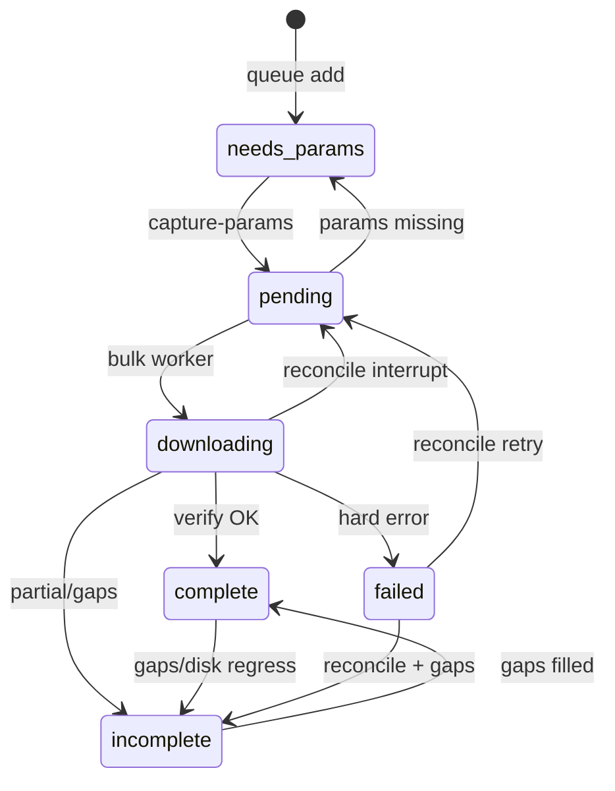

# Queue state machine

**Source of truth file:** `templates/vehicles.json` (gitignored on operator machines)

**Canonical architecture:** [architecture.md](./architecture.md)

---

## Status values

| Status | Meaning | Bulk worker eligible? |
|--------|---------|----------------------|
| `needs_params` | In fleet; no `params.json` yet | No |
| `pending` | `params.json` exists; ready for download | Yes |
| `downloading` | Worker claimed job | Yes (in-flight) |
| `incomplete` | Partial download or blocking gaps remain | Yes (gap-fill priority) |
| `failed` | Hard failure; may retry if enough PDFs on disk | Yes (see `queue-lib.js`) |
| `complete` | Verified on disk; no blocking gaps | No |
| `skip` | Intentionally excluded | No |

---

## Transition table

| From | To | Trigger | Module |
|------|-----|---------|--------|
| — | `needs_params` | Queue generation / `append-vehicle-queue.js` | `generate-vehicle-queue.js`, expansion |
| `needs_params` | `pending` | Params captured | `capture-params.ts` → `patch-queue.js` |
| `pending` | `downloading` | Worker starts | `bulk-download.sh` → `patch-queue.js` |
| `downloading` | `complete` | Verify OK, no blocking gaps | `bulk-download.sh` |
| `downloading` | `incomplete` | Partial success or gaps | `bulk-download.sh` |
| `downloading` | `failed` | Hard error | `bulk-download.sh` |
| `downloading` | `pending` / `incomplete` | Interrupted (reconcile) | `reconcile-queue.js` |
| `incomplete` | `complete` | Disk + gaps OK | `reconcile-queue.js`, bulk |
| `complete` | `incomplete` | Gaps reappear or disk incomplete | `reconcile-queue.js`, `backfill-capture-gaps.js` |
| `failed` | `pending` / `incomplete` | Retry with params, partial disk | `reconcile-queue.js` |
| `pending` / `failed` | `needs_params` | Params file missing | `reconcile-queue.js` |
| any (except `skip`) | `needs_params` | No params at worker pre-check | `bulk-download.sh` |

`skip` entries are never modified by reconcile.

---

## Queue write semantics

| Writer | Mechanism | When safe |
|--------|-----------|-----------|
| `patch-queue.js` | Read → patch one vehicle → tmp + rename | Anytime — **atomic file replace** (valid JSON guaranteed; concurrent patches to different vehicles can still race — last rename wins) |
| `reconcile-queue.js` | Whole-file rewrite | Workers idle (bulk does this when idle) |
| `backfill-capture-gaps.js` | Whole-file rewrite | Manual / startup (optional) |
| `generate-vehicle-queue.js` | **Destructive** rebuild | Never on live progress — use `append-vehicle-queue.js` |
| `append-vehicle-queue.js` | Append new IDs only | Safe expansion |

Bulk and capture **only** use `patch-queue.js` for status updates during runs.

---

## Worker selection (`scripts/queue-lib.js`)

Lower `queueRank` = sooner. Tier 1 anchors get −10 boost.

| Band (approx) | Status context |
|---------------|----------------|
| −10 | `incomplete` tier 1, fresh blocking gaps |
| 0 | `incomplete` tier 2+; `failed` tier 1 with ≥50 PDFs |
| 10 | `pending` tier 1; `failed` tier 2+ |
| 20+ | `pending` tier 2+; stale `incomplete` (all gaps ≥ `STALE_GAP_ATTEMPTS`) |

`needs_params` and `skip` are never selected.

Within band: `tier` asc, then `priority` asc.

---

## Completeness vs queue status

A vehicle can be:

- **`complete` in queue** but gaps visible in `capture-gaps.json` if hybrid-complete rules apply (see [schemas.md](./schemas.md#hybrid-complete)).
- **`incomplete` from worker** while reconcile later marks `complete` if JS gap lib says non-blocking — indicates TS/JS drift until Dev Guide 02.

---

## Ops policies (documented defaults)

| Policy | Default | Override |
|--------|---------|----------|
| Tier-1 gap-fill | Retry `incomplete` tier 1 before moving on | Operator may accept `incomplete` for fill years when subscription time is low |
| Pre-2003 capture | Deferred in capture sort; `--include-legacy` does not implement capture yet | Dev Guide 06 |

---

## Diagram

